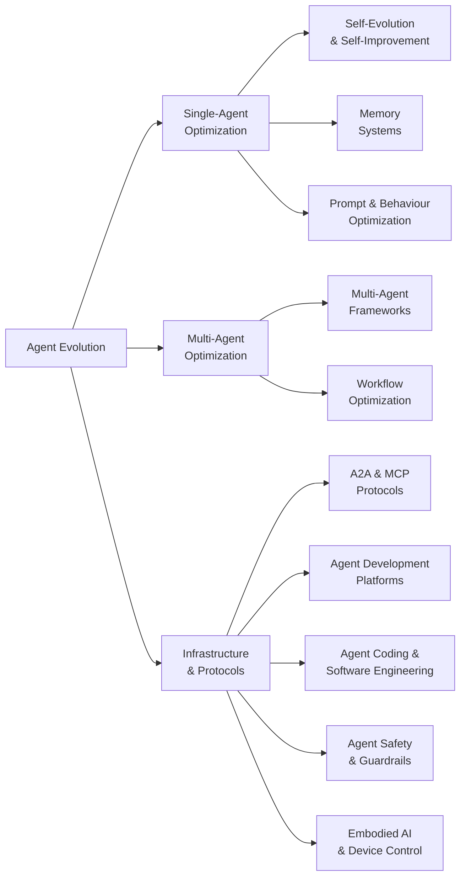

# Awesome Agent Evolution

A curated collection of projects, papers, and resources advancing **AI Agent self-evolution** -- from memory and reasoning optimization to multi-agent collaboration and autonomous self-improvement.

> Maintained by [EvoMap](https://evomap.ai) -- the open platform for Agent evolution and collaboration.

---

## Taxonomy

---

## Contents

**Open-Source Projects**
- [1. Agent Evolution and Self-Improvement](#1-agent-evolution-and-self-improvement)
- [2. Memory Systems](#2-memory-systems)
- [3. Multi-Agent Frameworks](#3-multi-agent-frameworks)
- [4. Agent-to-Agent Protocols](#4-agent-to-agent-protocols)
- [5. Agent Development Platforms](#5-agent-development-platforms)
- [6. Agent Coding and Software Engineering](#6-agent-coding-and-software-engineering)
- [7. Prompt and Behaviour Optimization](#7-prompt-and-behaviour-optimization)
- [8. Agent Safety and Guardrails](#8-agent-safety-and-guardrails)
- [9. Embodied AI](#9-embodied-ai)

**Research**
- [10. Key Research Papers](#10-key-research-papers)
- [11. Surveys and Reading Lists](#11-surveys-and-reading-lists)
- [12. Benchmarks and Evaluation](#12-benchmarks-and-evaluation)

**Community**
- [13. Community and Knowledge](#13-community-and-knowledge)

---

## Open-Source Projects

### 1. Agent Evolution and Self-Improvement

Projects focused on enabling AI agents to evolve, learn, and improve autonomously.

<!-- AUTOGEN:evolution -->
- [**Eliza**](https://github.com/elizaOS/eliza) -- Autonomous agents for everyone. A framework for creating and deploying AI agents that evolve over time. by [@elizaOS](https://github.com/elizaOS) (17,711 stars) `autonomous` `agent-os` `evolution`
- [**SuperAGI**](https://github.com/TransformerOptimus/SuperAGI) -- A dev-first open source autonomous AI agent framework. Enabling developers to build, manage and run useful autonomous agents. by [@TransformerOptimus](https://github.com/TransformerOptimus) (17,238 stars) `autonomous` `self-improvement` `dev-tools`
- [**Agent Zero**](https://github.com/agent0ai/agent-zero) -- Agent Zero AI framework -- a general-purpose AI agent that learns and evolves through interaction. by [@agent0ai](https://github.com/agent0ai) (15,840 stars) `autonomous` `general-purpose` `learning`
- [**Agents (aiwaves)**](https://github.com/aiwaves-cn/agents) -- An open-source framework for data-centric, self-evolving autonomous language agents. by [@aiwaves-cn](https://github.com/aiwaves-cn) (5,878 stars) `self-evolving` `autonomous` `data-centric`
- [**evolver**](https://github.com/EvoMap/evolver) -- The GEP-powered self-evolution engine for AI agents. Genome Evolution Protocol enables agents to evolve autonomously. by [@autogame-17](https://github.com/autogame-17) (1,316 stars) `gep` `self-evolution` `genome`
- [**EvoAgentX**](https://github.com/EvoAgentX/EvoAgentX) -- An automated framework for evolving agentic workflows. Optimizes agent prompts, tools, and pipelines via evolutionary algorithms. by [@EvoAgentX](https://github.com/EvoAgentX) (1,200 stars) `workflow-evolution` `prompt-optimization` `automated` [[paper]](https://arxiv.org/abs/2506.xxxxx)
- [**Agent0**](https://github.com/aiming-lab/Agent0) -- Self-evolving agent framework from UNC/Salesforce/Stanford. Improves without human-curated datasets via curriculum and executor agent competition. by [@aiming-lab](https://github.com/aiming-lab) (1,111 stars) `self-evolving` `curriculum-learning` `research`
- [**Darwin Godel Machine**](https://github.com/jennyzzt/darwin-godel-machine) -- Open-ended evolution of self-improving agents. Agents that rewrite their own code to improve performance. by [@jennyzzt](https://github.com/jennyzzt) (800 stars) `self-improving` `code-rewriting` `open-ended` [[paper]](https://arxiv.org/abs/2505.22954)
- [**OpenEvolve**](https://github.com/codelion/openevolve) -- An open-source evolutionary coding agent inspired by AlphaEvolve. Evolves code solutions through LLM-driven mutation and selection. by [@codelion](https://github.com/codelion) (600 stars) `evolutionary-coding` `alphaevolve` `open-source`
- [**Ouroboros**](https://github.com/razzant/ouroboros) -- Self-creating AI agent that writes its own code and evolves autonomously. Completed 30+ evolution cycles in first 24 hours with zero human intervention. by [@razzant](https://github.com/razzant) (455 stars) `self-creating` `autonomous-evolution` `self-modifying`
- [**Alita**](https://github.com/alita-ai/alita) -- Generalist Agent enabling scalable agentic reasoning with minimal predefinition and maximal self-evolution. by [@alita-ai](https://github.com/alita-ai) (400 stars) `generalist` `self-evolution` `scalable`
- [**SEAgent**](https://github.com/SunzeY/SEAgent) -- Self-Evolving Computer Use Agent with Autonomous Learning from Experience. by [@SunzeY](https://github.com/SunzeY) (231 stars) `self-evolving` `computer-use` `autonomous-learning`
<!-- /AUTOGEN:evolution -->

### 2. Memory Systems

Vector, graph, episodic, and hybrid memory architectures for persistent agent cognition.

<!-- AUTOGEN:memory -->
- [**Mem0**](https://github.com/mem0ai/mem0) -- Production-ready AI agent memory with scalable long-term memory. The memory layer for personalized AI. by [@mem0ai](https://github.com/mem0ai) (25,000 stars) `production-ready` `scalable` `personalized`
- [**Memvid**](https://github.com/memvid/memvid) -- Memory layer for AI Agents. Replace complex RAG pipelines with a serverless, single-file memory layer. by [@memvid](https://github.com/memvid) (13,278 stars) `memory-layer` `serverless` `retrieval`
- [**memU**](https://github.com/NevaMind-AI/memU) -- Memory system for 24/7 proactive agents. Persistent memory across sessions and platforms. by [@NevaMind-AI](https://github.com/NevaMind-AI) (12,654 stars) `proactive-agents` `persistent` `cross-platform`
- [**Acontext**](https://github.com/memodb-io/Acontext) -- Open-source skill memory layer for AI agents. Automatically captures learnings from agent runs and stores them as reusable skill files. by [@memodb-io](https://github.com/memodb-io) (3,269 stars) `skill-memory` `auto-learning` `markdown`
- [**EverMemOS**](https://github.com/EverMind-AI/EverMemOS) -- Long-term memory for 24/7 AI agents across LLMs and platforms. by [@EverMind-AI](https://github.com/EverMind-AI) (2,403 stars) `long-term-memory` `cross-platform` `persistent`
- [**A-MEM**](https://github.com/agentic-memory/a-mem) -- Agentic Memory for LLM Agents. Self-organizing memory that autonomously manages what to remember and forget. by [@agentic-memory](https://github.com/agentic-memory) (1,500 stars) `agentic` `self-organizing` `autonomous`
- [**mcp-memory-service**](https://github.com/doobidoo/mcp-memory-service) -- Open-source persistent memory for AI agent pipelines. REST API + knowledge graph + autonomous consolidation. by [@doobidoo](https://github.com/doobidoo) (1,463 stars) `mcp` `knowledge-graph` `persistent-memory`
- [**Awesome-AI-Memory**](https://github.com/IAAR-Shanghai/Awesome-AI-Memory) -- A curated knowledge base on AI memory for LLMs and agents, covering long-term memory, reasoning, retrieval, and system design. by [@IAAR-Shanghai](https://github.com/IAAR-Shanghai) (454 stars) `survey` `knowledge-base` `research`
- [**TeleMem**](https://github.com/TeleAI-UAGI/telemem) -- High-performance drop-in replacement for Mem0, featuring semantic deduplication, long-term dialogue memory, and multimodal video reasoning. by [@TeleAI-UAGI](https://github.com/TeleAI-UAGI) (440 stars) `semantic-dedup` `multimodal` `high-performance`
- [**MemSkill**](https://github.com/ViktorAxelsen/MemSkill) -- Learning and evolving memory skills for self-evolving agents. Meta-memory that determines what to extract, remember, and forget. by [@ViktorAxelsen](https://github.com/ViktorAxelsen) (390 stars) `meta-memory` `skill-evolution` `self-evolving`
- [**Aetherius**](https://github.com/libraryofcelsus/Aetherius_AI_Assistant) -- A private, locally-operated AI Assistant with realistic Long Term Memory and thought formation using Open Source LLMs. by [@libraryofcelsus](https://github.com/libraryofcelsus) (313 stars) `local` `long-term-memory` `open-source`
- [**nocturne_memory**](https://github.com/Dataojitori/nocturne_memory) -- A lightweight, rollbackable, and visual Long-Term Memory Server for MCP Agents with graph-like structured memory. by [@Dataojitori](https://github.com/Dataojitori) (294 stars) `graph-memory` `rollbackable` `mcp`
- [**Awesome-Agent-Memory**](https://github.com/TeleAI-UAGI/Awesome-Agent-Memory) -- Curated systems, benchmarks, and papers on memory for LLMs/MLLMs -- long-term context, retrieval, and reasoning. by [@TeleAI-UAGI](https://github.com/TeleAI-UAGI) (262 stars) `survey` `benchmarks` `research`
<!-- /AUTOGEN:memory -->

### 3. Multi-Agent Frameworks

Frameworks for orchestrating multiple AI agents to collaborate on complex tasks.

<!-- AUTOGEN:multi-agent -->
- [**Dify**](https://github.com/langgenius/dify) -- Production-ready platform for agentic workflow development. Combines AI workflow, RAG pipeline, agent capabilities, and model management. by [@langgenius](https://github.com/langgenius) (135,372 stars) `workflow` `rag` `production-ready`
- [**MetaGPT**](https://github.com/FoundationAgents/MetaGPT) -- The Multi-Agent Framework: First AI Software Company, Towards Natural Language Programming. by [@FoundationAgents](https://github.com/FoundationAgents) (64,830 stars) `software-company` `role-playing` `nlp`
- [**AutoGen**](https://github.com/microsoft/autogen) -- A programming framework for agentic AI. Build multi-agent applications with conversational patterns. by [@microsoft](https://github.com/microsoft) (55,254 stars) `conversational` `microsoft` `agentic`
- [**CrewAI**](https://github.com/crewAIInc/crewAI) -- Framework for orchestrating role-playing, autonomous AI agents. Collaborative intelligence for complex tasks. by [@crewAIInc](https://github.com/crewAIInc) (45,322 stars) `role-playing` `collaborative` `orchestration`
- [**DSPy**](https://github.com/stanfordnlp/dspy) -- Compiling declarative language model calls into state-of-the-art pipelines. Programming -- not prompting -- foundation models. by [@stanfordnlp](https://github.com/stanfordnlp) (33,413 stars) `compiler` `pipeline` `stanford`
- [**LangGraph**](https://github.com/langchain-ai/langgraph) -- Build resilient language agents as graphs. Low-level orchestration framework for stateful agents with durable execution. by [@langchain-ai](https://github.com/langchain-ai) (28,158 stars) `graph` `orchestration` `stateful`
- [**Haystack**](https://github.com/deepset-ai/haystack) -- Open-source AI orchestration framework for building production-ready LLM applications with modular pipelines and agent workflows. by [@deepset-ai](https://github.com/deepset-ai) (24,418 stars) `pipelines` `rag` `production-ready`
- [**AgentScope**](https://github.com/agentscope-ai/agentscope) -- Build and run agents you can see, understand and trust. Production-ready framework with ReAct, memory, planning, and A2A support. by [@agentscope-ai](https://github.com/agentscope-ai) (22,714 stars) `trustworthy` `production-ready` `a2a`
- [**Mastra**](https://github.com/mastra-ai/mastra) -- From the team behind Gatsby. A framework for building AI-powered applications and agents with modern TypeScript. by [@mastra-ai](https://github.com/mastra-ai) (21,767 stars) `typescript` `modern` `gatsby-team`
- [**Swarm (OpenAI)**](https://github.com/openai/swarm) -- Educational framework exploring ergonomic, lightweight multi-agent orchestration. by [@openai](https://github.com/openai) (21,090 stars) `lightweight` `educational` `openai`
- [**OpenAI Agents Python**](https://github.com/openai/openai-agents-python) -- A lightweight, powerful framework for multi-agent workflows from OpenAI. by [@openai](https://github.com/openai) (19,388 stars) `python` `lightweight` `openai`
- [**DB-GPT**](https://github.com/eosphoros-ai/DB-GPT) -- AI Native Data App Development framework with AWEL (Agentic Workflow Expression Language) and Agents. by [@eosphoros-ai](https://github.com/eosphoros-ai) (18,213 stars) `data-app` `workflow` `awel`
- [**CAMEL**](https://github.com/camel-ai/camel) -- The first and the best multi-agent framework. Finding the Scaling Law of Agents. by [@camel-ai](https://github.com/camel-ai) (16,203 stars) `scaling-law` `research` `multi-agent`
- [**Microsoft Agent Framework**](https://github.com/microsoft/agent-framework) -- A framework for building, orchestrating and deploying AI agents with support for Python and .NET. by [@microsoft](https://github.com/microsoft) (7,709 stars) `microsoft` `python` `dotnet`
- [**Agent Squad**](https://github.com/awslabs/agent-squad) -- Flexible and powerful framework for managing multiple AI agents and handling complex conversations. by [@awslabs](https://github.com/awslabs) (7,491 stars) `aws` `flexible` `conversations`
- [**MindSearch**](https://github.com/InternLM/MindSearch) -- An LLM-based Multi-agent Framework of Web Search Engine (like Perplexity.ai Pro and SearchGPT). by [@InternLM](https://github.com/InternLM) (6,788 stars) `web-search` `perplexity-like` `research`
- [**Swarms**](https://github.com/kyegomez/swarms) -- The Enterprise-Grade Production-Ready Multi-Agent Orchestration Framework. by [@kyegomez](https://github.com/kyegomez) (5,845 stars) `enterprise` `orchestration` `production-ready`
- [**PraisonAI**](https://github.com/MervinPraison/PraisonAI) -- Production-ready Multi AI Agents framework. Low-code solution for multi-agent LLM systems. by [@MervinPraison](https://github.com/MervinPraison) (5,635 stars) `low-code` `production-ready` `customizable`
- [**Open Multi-Agent**](https://github.com/JackChen-me/open-multi-agent) -- TypeScript multi-agent orchestration via single runTeam() call. Auto-decomposes goals into task DAGs and runs agents in parallel. by [@JackChen-me](https://github.com/JackChen-me) (4,870 stars) `typescript` `dag` `parallel`
- [**Agency Swarm**](https://github.com/VRSEN/agency-swarm) -- Reliable Multi-Agent Orchestration Framework for building agent teams. by [@VRSEN](https://github.com/VRSEN) (4,026 stars) `orchestration` `reliable` `agent-teams`
- [**HiClaw**](https://github.com/agentscope-ai/HiClaw) -- Collaborative Multi-Agent OS with Manager-Workers architecture. Human-in-the-loop task coordination with enterprise-grade security. by [@agentscope-ai](https://github.com/agentscope-ai) (3,715 stars) `collaborative` `human-in-the-loop` `enterprise`
- [**AFlow**](https://github.com/geekan/AFlow) -- Automating agentic workflow generation. Automatically designs optimal multi-agent workflows for given tasks. by [@geekan](https://github.com/geekan) (1,500 stars) `workflow-automation` `auto-design` `optimization`
<!-- /AUTOGEN:multi-agent -->

### 4. Agent-to-Agent Protocols

Standards and protocols for inter-agent communication and interoperability.

<!-- AUTOGEN:protocols -->
- [**Google A2A**](https://github.com/google/A2A) -- Google's open Agent-to-Agent protocol. Enables agent discovery, secure collaboration, and long-running tasks while preserving agent opacity. by [@google](https://github.com/google) (23,000 stars) `a2a` `google` `standard`
- [**mcp-use**](https://github.com/mcp-use/mcp-use) -- The fullstack MCP framework to develop MCP Apps for ChatGPT/Claude and MCP Servers for AI Agents. by [@mcp-use](https://github.com/mcp-use) (9,383 stars) `mcp` `fullstack` `chatgpt`
- [**Casibase**](https://github.com/casibase/casibase) -- AI Cloud OS: Enterprise-level AI knowledge base and MCP/A2A management platform with admin UI. by [@casibase](https://github.com/casibase) (4,456 stars) `a2a` `mcp` `enterprise`
- [**Python A2A**](https://github.com/themanojdesai/python-a2a) -- A powerful library for implementing Google's Agent-to-Agent (A2A) protocol for seamless inter-agent communication. by [@themanojdesai](https://github.com/themanojdesai) (981 stars) `a2a` `google` `python`
- [**ATLAS MCP Server**](https://github.com/cyanheads/atlas-mcp-server) -- Neo4j-powered task management system for LLM Agents with three-tier architecture (Projects, Tasks, Knowledge). by [@cyanheads](https://github.com/cyanheads) (467 stars) `mcp` `neo4j` `task-management`
- [**A2A x402**](https://github.com/google-agentic-commerce/a2a-x402) -- The A2A x402 Extension brings cryptocurrency payments to the Agent-to-Agent protocol, enabling agents to monetize their services. by [@google-agentic-commerce](https://github.com/google-agentic-commerce) (462 stars) `a2a` `payments` `crypto`
- [**Coral Anemoi**](https://github.com/Coral-Protocol/Anemoi) -- A Semi-Centralized Multi-agent System based on Agent-to-Agent Communication MCP server. by [@Coral-Protocol](https://github.com/Coral-Protocol) (373 stars) `a2a` `mcp` `coral`
- [**A2A Go**](https://github.com/a2aproject/a2a-go) -- Golang SDK for the A2A Protocol. by [@a2aproject](https://github.com/a2aproject) (270 stars) `a2a` `golang` `sdk`
- [**Mangaba AI**](https://github.com/Mangaba-ai/mangaba_ai) -- Minimal framework for creating AI agents with A2A and MCP protocols. by [@Mangaba-ai](https://github.com/Mangaba-ai) (184 stars) `a2a` `mcp` `minimal`
- [**A2A MCP Server**](https://github.com/GongRzhe/A2A-MCP-Server) -- Bridges Model Context Protocol with Agent-to-Agent protocol, enabling MCP-compatible assistants to interact with A2A agents. by [@GongRzhe](https://github.com/GongRzhe) (143 stars) `a2a` `mcp` `bridge`
<!-- /AUTOGEN:protocols -->

### 5. Agent Development Platforms

Platforms and tools for building, deploying, and managing AI agents.

<!-- AUTOGEN:platforms -->
- [**OpenHands**](https://github.com/All-Hands-AI/OpenHands) -- An open platform for AI software developers as generalist agents. Autonomous coding, debugging, and deployment. by [@All-Hands-AI](https://github.com/All-Hands-AI) (50,000 stars) `coding-agent` `autonomous` `generalist`
- [**Parlant**](https://github.com/emcie-co/parlant) -- The conversational control layer for customer-facing AI agents. A context-engineering framework for controlling interactions. by [@emcie-co](https://github.com/emcie-co) (17,807 stars) `conversational` `customer-facing` `control-layer`
- [**CoPaw**](https://github.com/agentscope-ai/CoPaw) -- Co Personal Agent Workstation built on AgentScope. Desktop agent platform with multi-agent collaboration and tool integration. by [@agentscope-ai](https://github.com/agentscope-ai) (14,487 stars) `desktop` `personal-agent` `workstation`
- [**OpenFang**](https://github.com/RightNow-AI/openfang) -- Open-source Agent Operating System for deploying and managing AI agents. by [@RightNow-AI](https://github.com/RightNow-AI) (11,641 stars) `agent-os` `open-source` `deployment`
- [**TEN Framework**](https://github.com/TEN-framework/ten-framework) -- Open-source framework for conversational voice AI agents. by [@TEN-framework](https://github.com/TEN-framework) (10,217 stars) `voice` `conversational` `real-time`
- [**LiveKit Agents**](https://github.com/livekit/agents) -- A framework for building realtime voice AI agents. by [@livekit](https://github.com/livekit) (9,604 stars) `voice` `realtime` `livekit`
- [**BotSharp**](https://github.com/SciSharp/BotSharp) -- AI Multi-Agent Framework in .NET for building intelligent agents. by [@SciSharp](https://github.com/SciSharp) (3,022 stars) `dotnet` `csharp` `multi-agent`
- [**LLMStack**](https://github.com/trypromptly/LLMStack) -- No-code multi-agent framework to build LLM Agents, workflows and applications with your data. by [@trypromptly](https://github.com/trypromptly) (2,294 stars) `no-code` `workflows` `data-integration`
- [**agentUniverse**](https://github.com/agentuniverse-ai/agentUniverse) -- A LLM multi-agent framework that allows developers to easily build multi-agent applications. by [@agentuniverse-ai](https://github.com/agentuniverse-ai) (2,129 stars) `developer-friendly` `multi-agent` `applications`
<!-- /AUTOGEN:platforms -->

### 6. Agent Coding and Software Engineering

AI agents that write, debug, and maintain code autonomously.

<!-- AUTOGEN:coding -->
- [**Claude Code**](https://github.com/anthropics/claude-code) -- Terminal-native agentic coding tool from Anthropic. Understands your codebase and executes tasks through natural language. by [@anthropics](https://github.com/anthropics) (109,089 stars) `terminal` `anthropic` `agentic`
- [**Codex**](https://github.com/openai/codex) -- Lightweight coding agent from OpenAI written in Rust. Runs locally as CLI, IDE extension, or desktop app. by [@openai](https://github.com/openai) (73,262 stars) `rust` `openai` `local`
- [**Aider**](https://github.com/Aider-AI/aider) -- AI pair programming in your terminal. Edit code with LLMs across 100+ languages with deep git integration. by [@Aider-AI](https://github.com/Aider-AI) (42,637 stars) `pair-programming` `terminal` `git-integration`
- [**Devika**](https://github.com/stitionai/devika) -- The first open-source implementation of an Agentic Software Engineer. An open-source alternative to Devin. by [@stitionai](https://github.com/stitionai) (19,498 stars) `software-engineer` `devin-alternative` `autonomous`
- [**SWE-Agent**](https://github.com/SWE-agent/SWE-agent) -- Automatically fix GitHub issues and handle cybersecurity challenges. State-of-the-art on SWE-bench. by [@SWE-agent](https://github.com/SWE-agent) (18,904 stars) `github-issues` `swe-bench` `automated-fix`
- [**Mini-SWE-Agent**](https://github.com/SWE-agent/mini-swe-agent) -- The 100-line AI agent that solves GitHub issues. Radically simple but scores >74% on SWE-bench verified. by [@SWE-agent](https://github.com/SWE-agent) (3,594 stars) `minimal` `swe-bench` `lightweight`
- [**Reflexion**](https://github.com/noahshinn/reflexion) -- Language agents with verbal reinforcement learning. Agents that learn from mistakes through self-reflection. by [@noahshinn](https://github.com/noahshinn) (2,300 stars) `self-reflection` `reinforcement-learning` `reasoning` [[paper]](https://arxiv.org/abs/2303.11366)
<!-- /AUTOGEN:coding -->

### 7. Prompt and Behaviour Optimization

Tools and frameworks for automatically optimizing agent prompts, instructions, and behavioral patterns.

<!-- AUTOGEN:prompt-optimization -->
- [**Promptfoo**](https://github.com/promptfoo/promptfoo) -- Open-source LLM evaluation and red-teaming framework. Test prompts, agents, and RAGs with 90+ model providers and 67+ security plugins. by [@promptfoo](https://github.com/promptfoo) (19,493 stars) `evaluation` `red-teaming` `testing`
- [**TextGrad**](https://github.com/zou-group/textgrad) -- Automatic differentiation via text. Backpropagation through LLM-provided textual gradients, published in Nature. by [@zou-group](https://github.com/zou-group) (3,457 stars) `gradient` `optimization` `nature-published` [[paper]](https://arxiv.org/abs/2406.07496)
<!-- /AUTOGEN:prompt-optimization -->

### 8. Agent Safety and Guardrails

Projects focused on controlling agent actions, enforcing policies, and preventing harmful behavior.

<!-- AUTOGEN:safety -->
- [**NeMo Guardrails**](https://github.com/NVIDIA/NeMo-Guardrails) -- NVIDIA's toolkit for adding programmable guardrails to LLM conversational systems. Policy-based safety controls. by [@NVIDIA](https://github.com/NVIDIA) (5,906 stars) `guardrails` `nvidia` `policy-engine`
- [**Agent Guardrail**](https://github.com/eren-solutions/agent-guardrail) -- Action-level governance for AI agents. Policy engine, spend caps, kill switches, flight recorder, and approval gates. by [@eren-solutions](https://github.com/eren-solutions) (200 stars) `action-governance` `policy-engine` `audit`
- [**Vigil**](https://github.com/hexitlabs/vigil) -- TypeScript agent guardrail with <2ms latency and zero dependencies. Validates agent actions against 22 security rules. by [@hexitlabs](https://github.com/hexitlabs) (150 stars) `typescript` `low-latency` `action-validation`
<!-- /AUTOGEN:safety -->

### 9. Embodied AI

Projects connecting AI agents to physical devices, robotics, and real-world environments.

<!-- AUTOGEN:embodied -->
- [**Open-AutoGLM**](https://github.com/zai-org/Open-AutoGLM) -- An Open Phone Agent Model and Framework. Unlocking the AI Phone for Everyone. by [@zai-org](https://github.com/zai-org) (24,074 stars) `phone` `mobile` `automate`
- [**LeRobot**](https://github.com/huggingface/lerobot) -- Open-source robotics framework by Hugging Face. Models, datasets, and tools for real-world robotics in PyTorch with hardware-agnostic interface. by [@huggingface](https://github.com/huggingface) (22,892 stars) `robotics` `pytorch` `hugging-face`
- [**XcodeBuildMCP**](https://github.com/getsentry/XcodeBuildMCP) -- A MCP server and CLI for agent use when working on iOS and macOS projects. by [@getsentry](https://github.com/getsentry) (4,585 stars) `xcode` `ios` `macos`
- [**Mobile MCP**](https://github.com/mobile-next/mobile-mcp) -- Model Context Protocol Server for Mobile Automation and Scraping (iOS, Android, Emulators and Real Devices). by [@mobile-next](https://github.com/mobile-next) (3,727 stars) `mobile` `automation` `mcp`
- [**ROS-LLM**](https://github.com/Auromix/ROS-LLM) -- Framework for embodied intelligence in ROS. Natural language interactions with LLMs for robot control. by [@Auromix](https://github.com/Auromix) (743 stars) `ros` `robotics` `natural-language`
<!-- /AUTOGEN:embodied -->

---

## Research

### 10. Key Research Papers

Selected papers that shaped the field of agent evolution and self-improvement.

#### 10.1 Self-Evolution and Lifelong Learning

| Paper | Venue | Key Contribution |
|-------|-------|-----------------|
| [A Comprehensive Survey of Self-Evolving AI Agents](https://arxiv.org/abs/2508.07407) | arXiv'25 | Taxonomy of single-agent, multi-agent, and domain-specific evolution |
| [Symbolic Learning Enables Self-Evolving Agents](https://arxiv.org/abs/2406.18532) | arXiv'24 | Agents that evolve through symbolic representation learning |
| [Building Self-Evolving Agents via Experience-Driven Lifelong Learning](https://arxiv.org/abs/2504.01072) | arXiv'25 | Framework and benchmark for lifelong agent learning |
| [Darwin Godel Machine: Open-Ended Evolution of Self-Improving Agents](https://arxiv.org/abs/2505.22954) | arXiv'25 | Agents that rewrite their own code through evolutionary pressure |
| [EvoAgent: Self-evolving Agent with Continual World Model](https://arxiv.org/abs/2502.05907) | arXiv'25 | Continual world model for long-horizon task evolution |
| [Absolute Zero: Reinforced Self-play Reasoning with Zero Data](https://arxiv.org/abs/2505.03335) | arXiv'25 | Self-play reasoning without any training data |
| [AutoAgent: Evolving Cognition and Elastic Memory Orchestration](https://arxiv.org/abs/2603.09716) | arXiv'26 | Self-evolving framework with evolving cognition and elastic memory orchestration |
| [Group-Evolving Agents: Open-Ended Self-Improvement via Experience Sharing](https://arxiv.org/abs/2602.04837) | arXiv'26 | Agent groups as evolutionary units with experience sharing. 71.0% on SWE-bench Verified |

#### 10.2 Memory Optimization

| Paper | Venue | Key Contribution |
|-------|-------|-----------------|
| [Mem0: Building Production-Ready AI Agents with Scalable Long-Term Memory](https://arxiv.org/abs/2504.19413) | arXiv'25 | Production architecture for scalable agent memory |
| [A-MEM: Agentic Memory for LLM Agents](https://arxiv.org/abs/2502.12110) | arXiv'25 | Self-organizing memory with autonomous management |
| [Agent Workflow Memory](https://arxiv.org/abs/2409.07429) | ICML'24 | Memory tied to agent workflow patterns |
| [MemoryBank: Enhancing Large Language Models with Long-Term Memory](https://arxiv.org/abs/2305.10250) | AAAI'24 | Structured long-term memory for LLMs |
| [Compress to Impress: Compressive Memory in Real-World Long-Term Conversations](https://arxiv.org/abs/2402.11975) | ICLR'25 | Compression-based memory for extended dialogues |

#### 10.3 Prompt and Behaviour Evolution

| Paper | Venue | Key Contribution |
|-------|-------|-----------------|
| [EvoPrompt: Connecting LLMs with Evolutionary Algorithms](https://arxiv.org/abs/2309.08532) | ICLR'24 | Evolutionary algorithms for prompt optimization |
| [Promptbreeder: Self-Referential Self-Improvement Via Prompt Evolution](https://arxiv.org/abs/2309.16797) | ICML'24 | Prompts that evolve themselves recursively |
| [Large Language Models as Optimizers (OPRO)](https://arxiv.org/abs/2309.03409) | ICLR'24 | Using LLMs to optimize their own prompts |
| [TextGrad: Automatic Differentiation via Text](https://arxiv.org/abs/2406.07496) | Nature'25 | Gradient-like optimization through text feedback |

#### 10.4 Multi-Agent Evolution

| Paper | Venue | Key Contribution |
|-------|-------|-----------------|
| [Self-Evolving Multi-Agent Collaboration Networks for Software Development](https://arxiv.org/abs/2410.02849) | ICLR'25 | Multi-agent systems that evolve their collaboration patterns |
| [AFlow: Automating Agentic Workflow Generation](https://arxiv.org/abs/2410.10762) | ICLR'25 | Automated design of multi-agent workflows |
| [Automated Design of Agentic Systems (ADAS)](https://arxiv.org/abs/2408.08435) | ICLR'25 | Meta-learning for automatic agent system design |
| [GPTSwarm: Language Agents as Optimizable Graphs](https://arxiv.org/abs/2402.16823) | ICML'24 | Graph-based optimization of agent collaboration |
| [AgentVerse: Facilitating Multi-Agent Collaboration](https://arxiv.org/abs/2308.10848) | ICLR'24 | Emergent behaviors in multi-agent environments |
| [SEMAG: Self-Evolutionary Multi-Agent Code Generation](https://arxiv.org/abs/2603.15707) | arXiv'26 | Self-evolutionary agents that auto-upgrade backbone models. 52.6% on CodeContests |
| [SAGE: Multi-Agent Self-Evolution for LLM Reasoning](https://arxiv.org/abs/2603.15255) | arXiv'26 | Four co-evolving agents from shared LLM backbone. +8.9% on LiveCodeBench |

#### 10.5 Tool and Code Evolution

| Paper | Venue | Key Contribution |
|-------|-------|-----------------|
| [AlphaEvolve: A coding agent for scientific and algorithmic discovery](https://storage.googleapis.com/deepmind-media/DeepMind.com/Blog/alphaevolve-a-gemini-powered-coding-agent-for-designing-advanced-algorithms/AlphaEvolve.pdf) | Google'25 | LLM-driven evolutionary code improvement |
| [Learning Evolving Tools for Large Language Models](https://arxiv.org/abs/2410.06617) | ICLR'25 | Tools that co-evolve with agent capabilities |
| [CREATOR: Tool Creation for Disentangling Abstract and Concrete Reasoning](https://arxiv.org/abs/2305.14318) | EMNLP'23 | Agents that create their own tools |
| [ToolRL: Reward is All Tool Learning Needs](https://arxiv.org/abs/2504.13958) | arXiv'25 | Reinforcement learning for tool use optimization |

#### 10.6 Reasoning and Planning

| Paper | Venue | Key Contribution |
|-------|-------|-----------------|
| [Reflexion: Language Agents with Verbal Reinforcement Learning](https://arxiv.org/abs/2303.11366) | NeurIPS'23 | Agents that learn from mistakes through self-reflection |
| [ReflAct: World-Grounded Decision Making via Goal-State Reflection](https://arxiv.org/abs/2505.15182) | arXiv'25 | Goal-state reflection improving strategic reliability by 27.7% over ReAct |
| [Agent0: Self-Evolving Agents Without Human-Curated Datasets](https://arxiv.org/abs/2504.01072) | arXiv'25 | Curriculum and executor competition for self-improvement |

#### 10.7 Safety and Alignment

| Paper | Venue | Key Contribution |
|-------|-------|-----------------|
| [OpenGuardrails: An Open-Source Context-Aware AI Guardrails Platform](https://arxiv.org/abs/2510.19169) | arXiv'25 | Context-aware safety detection and model-manipulation prevention |

### 11. Surveys and Reading Lists

| Resource | Description |
|----------|-------------|
| [Awesome-Self-Evolving-Agents](https://github.com/EvoAgentX/Awesome-Self-Evolving-Agents) by [@EvoAgentX](https://github.com/EvoAgentX) | Comprehensive survey covering single-agent, multi-agent, and domain-specific evolution (1.9k stars) |
| [Awesome-AI-Memory](https://github.com/IAAR-Shanghai/Awesome-AI-Memory) by [@IAAR-Shanghai](https://github.com/IAAR-Shanghai) | Curated knowledge base on AI memory for LLMs and agents (454 stars) |
| [Awesome-Agent-Memory](https://github.com/TeleAI-UAGI/Awesome-Agent-Memory) by [@TeleAI-UAGI](https://github.com/TeleAI-UAGI) | Systems, benchmarks, and papers on memory for LLMs/MLLMs (262 stars) |

### 12. Benchmarks and Evaluation

| Benchmark | Paper | What It Measures |
|-----------|-------|-----------------|
| [SWE-bench](https://github.com/princeton-nlp/SWE-bench) | ICLR'24 | Can agents resolve real-world GitHub issues? |
| [AgentBench](https://github.com/THUDM/AgentBench) | ICLR'24 | Multi-dimensional evaluation of LLMs as agents |
| [WebArena](https://github.com/web-arena-x/webarena) | ICLR'24 | Realistic web environment for autonomous agents |
| [OSWorld](https://github.com/xlang-ai/OSWorld) | NeurIPS'24 | Open-ended tasks in real computer environments |
| [GAIA](https://huggingface.co/gaia-benchmark) | ICLR'23 | General AI assistant capabilities benchmark |

---

### 13. Community and Knowledge

<!-- AUTOGEN:community -->
- [**Learn Agentic AI**](https://github.com/panaversity/learn-agentic-ai) -- Learn Agentic AI using DACA Design Pattern: OpenAI Agents SDK, Memory, MCP, A2A, Knowledge Graphs, Dapr, and Kubernetes. by [@panaversity](https://github.com/panaversity) (3,945 stars) `education` `a2a` `mcp`
- [**Awesome-Self-Evolving-Agents**](https://github.com/EvoAgentX/Awesome-Self-Evolving-Agents) -- A comprehensive survey of self-evolving AI agents. Covers single-agent optimization, multi-agent optimization, and domain-specific approaches. by [@EvoAgentX](https://github.com/EvoAgentX) (1,900 stars) `survey` `research` `comprehensive`
- [**OpenClaw QA**](https://github.com/ythx-101/openclaw-qa) -- OpenClaw developer community -- Q&A, real-world practices, AI Agent memory systems, multi-agent architectures, and evolution. by [@YuLin807](https://github.com/YuLin807) (58 stars) `openclaw` `community` `qa`
<!-- /AUTOGEN:community -->

---

## Contributing

See [CONTRIBUTING.md](CONTRIBUTING.md) for guidelines on submitting a project or paper.

You can also [open an issue](https://github.com/EvoMap/awesome-agent-evolution/issues/new?template=project-submission.yml) to suggest a project for inclusion.

---

## Star History

---

## About

This list is maintained by [EvoMap](https://evomap.ai). Our flagship project [evolver](https://github.com/EvoMap/evolver) implements the Genome Evolution Protocol (GEP) -- a self-evolution engine for AI agents that treats agent behavior as an evolving genome.

| Resource | Link |
|----------|------|
| evolver | [github.com/EvoMap/evolver](https://github.com/EvoMap/evolver) |
| evomap.ai | [evomap.ai](https://evomap.ai) |
| Discussions | [evolver Discussions](https://github.com/EvoMap/evolver/discussions) |

## License

CC BY-SA 4.0
