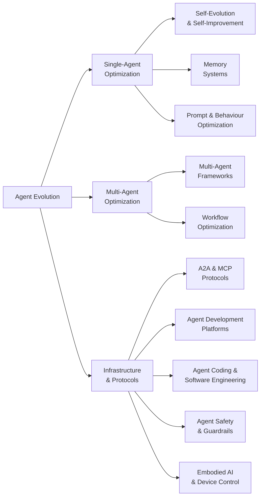

# Awesome Agent Evolution 

> AI Agent self-evolution, memory systems, multi-agent collaboration, and autonomous self-improvement.

## Contents

- [Taxonomy](#taxonomy)
- [Agent Evolution and Self-Improvement](#agent-evolution-and-self-improvement)
- [Memory Systems](#memory-systems)
- [Multi-Agent Frameworks](#multi-agent-frameworks)
- [Agent-to-Agent Protocols](#agent-to-agent-protocols)
- [Agent Development Platforms](#agent-development-platforms)
- [Agent Coding and Software Engineering](#agent-coding-and-software-engineering)
- [Prompt and Behaviour Optimization](#prompt-and-behaviour-optimization)
- [Agent Safety and Guardrails](#agent-safety-and-guardrails)
- [Embodied AI](#embodied-ai)
- [Key Research Papers](#key-research-papers)
- [Benchmarks and Evaluation](#benchmarks-and-evaluation)
- [Community and Knowledge](#community-and-knowledge)

## Taxonomy

## Agent Evolution and Self-Improvement

Projects focused on enabling AI agents to evolve, learn, and improve autonomously.

<!-- AUTOGEN:evolution -->
- [**Eliza**](https://github.com/elizaOS/eliza) - Autonomous agents for everyone. A framework for creating and deploying AI agents that evolve over time. by [@elizaOS](https://github.com/elizaOS) (18,099 stars)
- [**SuperAGI**](https://github.com/TransformerOptimus/SuperAGI) - A dev-first open source autonomous AI agent framework. Enabling developers to build, manage and run useful autonomous agents. by [@TransformerOptimus](https://github.com/TransformerOptimus) (17,422 stars)
- [**Agent Zero**](https://github.com/agent0ai/agent-zero) - General-purpose AI agent framework that learns and evolves through interaction. by [@agent0ai](https://github.com/agent0ai) (16,768 stars)
- [**Agents (aiwaves)**](https://github.com/aiwaves-cn/agents) - An open-source framework for data-centric, self-evolving autonomous language agents. by [@aiwaves-cn](https://github.com/aiwaves-cn) (5,895 stars)
- [**OpenEvolve**](https://github.com/codelion/openevolve) - An open-source evolutionary coding agent inspired by AlphaEvolve. Evolves code solutions through LLM-driven mutation and selection. by [@codelion](https://github.com/codelion) (5,860 stars)
- [**EvoAgentX**](https://github.com/EvoAgentX/EvoAgentX) - An automated framework for evolving agentic workflows. Optimizes agent prompts, tools, and pipelines via evolutionary algorithms. by [@EvoAgentX](https://github.com/EvoAgentX) (2,701 stars)
- [**HyperAgents**](https://github.com/facebookresearch/HyperAgents) - Self-referential self-improving agents by Meta that can optimize for any computable task. by [@facebookresearch](https://github.com/facebookresearch) (2,133 stars)
- [**evolver**](https://github.com/EvoMap/evolver) - The GEP-powered self-evolution engine for AI agents. Genome Evolution Protocol enables agents to evolve autonomously. by [@EvoMap](https://github.com/EvoMap) (1,832 stars)
- [**Agent0**](https://github.com/aiming-lab/Agent0) - Self-evolving agent framework from UNC/Salesforce/Stanford. Improves without human-curated datasets via curriculum and executor agent competition. by [@aiming-lab](https://github.com/aiming-lab) (1,131 stars)
- [**Darwin Godel Machine**](https://github.com/jennyzzt/darwin-godel-machine) - Open-ended evolution of self-improving agents. Agents that rewrite their own code to improve performance. by [@jennyzzt](https://github.com/jennyzzt) (800 stars)
- [**Ouroboros**](https://github.com/razzant/ouroboros) - Self-creating AI agent that writes its own code and evolves autonomously. Completed 30+ evolution cycles in first 24 hours with zero human intervention. by [@razzant](https://github.com/razzant) (463 stars)
- [**Alita**](https://github.com/alita-ai/alita) - Generalist Agent enabling scalable agentic reasoning with minimal predefinition and maximal self-evolution. by [@alita-ai](https://github.com/alita-ai) (400 stars)
- [**SEAgent**](https://github.com/SunzeY/SEAgent) - Self-Evolving Computer Use Agent with Autonomous Learning from Experience. by [@SunzeY](https://github.com/SunzeY) (237 stars)
<!-- /AUTOGEN:evolution -->

## Memory Systems

Vector, graph, episodic, and hybrid memory architectures for persistent agent cognition.

<!-- AUTOGEN:memory -->
- [**Mem0**](https://github.com/mem0ai/mem0) - Production-ready AI agent memory with scalable long-term memory. The memory layer for personalized AI. by [@mem0ai](https://github.com/mem0ai) (52,047 stars)
- [**Letta**](https://github.com/letta-ai/letta) - Platform for building stateful agents with advanced self-editing memory. Formerly MemGPT. by [@letta-ai](https://github.com/letta-ai) (21,904 stars)
- [**Cognee**](https://github.com/topoteretes/cognee) - Knowledge engine for AI agent memory. Build and query knowledge graphs from unstructured data in 6 lines of code. by [@topoteretes](https://github.com/topoteretes) (14,962 stars)
- [**Memvid**](https://github.com/memvid/memvid) - Memory layer for AI Agents. Replace complex RAG pipelines with a serverless, single-file memory layer. by [@memvid](https://github.com/memvid) (14,289 stars)
- [**memU**](https://github.com/NevaMind-AI/memU) - Memory system for 24/7 proactive agents. Persistent memory across sessions and platforms. by [@NevaMind-AI](https://github.com/NevaMind-AI) (13,308 stars)
- [**EverMemOS**](https://github.com/EverMind-AI/EverMemOS) - Long-term memory for 24/7 AI agents across LLMs and platforms. by [@EverMind-AI](https://github.com/EverMind-AI) (3,593 stars)
- [**Acontext**](https://github.com/memodb-io/Acontext) - Open-source skill memory layer for AI agents. Automatically captures learnings from agent runs and stores them as reusable skill files. by [@memodb-io](https://github.com/memodb-io) (3,273 stars)
- [**mcp-memory-service**](https://github.com/doobidoo/mcp-memory-service) - Open-source persistent memory for AI agent pipelines. REST API + knowledge graph + autonomous consolidation. by [@doobidoo](https://github.com/doobidoo) (1,614 stars)
- [**A-MEM**](https://github.com/agentic-memory/a-mem) - Agentic Memory for LLM Agents. Self-organizing memory that autonomously manages what to remember and forget. by [@agentic-memory](https://github.com/agentic-memory) (1,500 stars)
- [**nocturne_memory**](https://github.com/Dataojitori/nocturne_memory) - A lightweight, rollbackable, and visual Long-Term Memory Server for MCP Agents with graph-like structured memory. by [@Dataojitori](https://github.com/Dataojitori) (914 stars)
- [**Mem9**](https://github.com/mem9-ai/mem9) - Unlimited persistent memory layer for AI agents. Cloud-synced memory across sessions and tools. by [@mem9-ai](https://github.com/mem9-ai) (861 stars)
- [**Awesome-AI-Memory**](https://github.com/IAAR-Shanghai/Awesome-AI-Memory) - A curated knowledge base on AI memory for LLMs and agents, covering long-term memory, reasoning, retrieval, and system design. by [@IAAR-Shanghai](https://github.com/IAAR-Shanghai) (662 stars)
- [**TeleMem**](https://github.com/TeleAI-UAGI/telemem) - High-performance drop-in replacement for Mem0, featuring semantic deduplication, long-term dialogue memory, and multimodal video reasoning. by [@TeleAI-UAGI](https://github.com/TeleAI-UAGI) (457 stars)
- [**MemSkill**](https://github.com/ViktorAxelsen/MemSkill) - Learning and evolving memory skills for self-evolving agents. Meta-memory that determines what to extract, remember, and forget. by [@ViktorAxelsen](https://github.com/ViktorAxelsen) (390 stars)
- [**Awesome-Agent-Memory**](https://github.com/TeleAI-UAGI/Awesome-Agent-Memory) - Curated systems, benchmarks, and papers on memory for LLMs/MLLMs -- long-term context, retrieval, and reasoning. by [@TeleAI-UAGI](https://github.com/TeleAI-UAGI) (325 stars)
- [**Aetherius**](https://github.com/libraryofcelsus/Aetherius_AI_Assistant) - A private, locally-operated AI Assistant with realistic Long Term Memory and thought formation using Open Source LLMs. by [@libraryofcelsus](https://github.com/libraryofcelsus) (315 stars)
<!-- /AUTOGEN:memory -->

## Multi-Agent Frameworks

Frameworks for orchestrating multiple AI agents to collaborate on complex tasks.

<!-- AUTOGEN:multi-agent -->
- [**Dify**](https://github.com/langgenius/dify) - Production-ready platform for agentic workflow development. Combines AI workflow, RAG pipeline, agent capabilities, and model management. by [@langgenius](https://github.com/langgenius) (136,275 stars)
- [**MetaGPT**](https://github.com/FoundationAgents/MetaGPT) - The Multi-Agent Framework: First AI Software Company, Towards Natural Language Programming. by [@FoundationAgents](https://github.com/FoundationAgents) (66,673 stars)
- [**DeerFlow**](https://github.com/bytedance/deer-flow) - Open-source long-horizon SuperAgent harness by ByteDance. Researches, codes, and creates with multi-agent collaboration. by [@bytedance](https://github.com/bytedance) (58,312 stars)
- [**AutoGen**](https://github.com/microsoft/autogen) - A programming framework for agentic AI. Build multi-agent applications with conversational patterns. by [@microsoft](https://github.com/microsoft) (56,730 stars)
- [**CrewAI**](https://github.com/crewAIInc/crewAI) - Framework for orchestrating role-playing, autonomous AI agents. Collaborative intelligence for complex tasks. by [@crewAIInc](https://github.com/crewAIInc) (48,116 stars)
- [**DSPy**](https://github.com/stanfordnlp/dspy) - Compiling declarative language model calls into state-of-the-art pipelines. Programming -- not prompting -- foundation models. by [@stanfordnlp](https://github.com/stanfordnlp) (33,467 stars)
- [**ChatDev**](https://github.com/OpenBMB/ChatDev) - Virtual software company via LLM-powered multi-agent collaboration. Agents play PM, architect, developer, and QA roles. by [@OpenBMB](https://github.com/OpenBMB) (32,589 stars)
- [**LangGraph**](https://github.com/langchain-ai/langgraph) - Build resilient language agents as graphs. Low-level orchestration framework for stateful agents with durable execution. by [@langchain-ai](https://github.com/langchain-ai) (28,493 stars)
- [**Haystack**](https://github.com/deepset-ai/haystack) - Open-source AI orchestration framework for building production-ready LLM applications with modular pipelines and agent workflows. by [@deepset-ai](https://github.com/deepset-ai) (24,723 stars)
- [**AgentScope**](https://github.com/agentscope-ai/agentscope) - Build and run agents you can see, understand and trust. Production-ready framework with ReAct, memory, planning, and A2A support. by [@agentscope-ai](https://github.com/agentscope-ai) (23,021 stars)
- [**Mastra**](https://github.com/mastra-ai/mastra) - From the team behind Gatsby. A framework for building AI-powered applications and agents with modern TypeScript. by [@mastra-ai](https://github.com/mastra-ai) (22,714 stars)
- [**Swarm (OpenAI)**](https://github.com/openai/swarm) - Educational framework exploring ergonomic, lightweight multi-agent orchestration. by [@OpenAI](https://github.com/OpenAI) (21,273 stars)
- [**OpenAI Agents Python**](https://github.com/openai/openai-agents-python) - A lightweight, powerful framework for multi-agent workflows from OpenAI. by [@OpenAI](https://github.com/OpenAI) (20,587 stars)
- [**DB-GPT**](https://github.com/eosphoros-ai/DB-GPT) - AI Native Data App Development framework with AWEL (Agentic Workflow Expression Language) and Agents. by [@eosphoros-ai](https://github.com/eosphoros-ai) (18,447 stars)
- [**CAMEL**](https://github.com/camel-ai/camel) - The first and the best multi-agent framework. Finding the Scaling Law of Agents. by [@camel-ai](https://github.com/camel-ai) (16,601 stars)
- [**Spring AI Alibaba**](https://github.com/alibaba/spring-ai-alibaba) - Agentic AI framework for Java developers by Alibaba. Enterprise-grade multi-agent support. by [@alibaba](https://github.com/alibaba) (9,098 stars)
- [**Microsoft Agent Framework**](https://github.com/microsoft/agent-framework) - A framework for building, orchestrating and deploying AI agents with support for Python and .NET. by [@microsoft](https://github.com/microsoft) (8,917 stars)
- [**Agent Squad**](https://github.com/awslabs/agent-squad) - Flexible and powerful framework for managing multiple AI agents and handling complex conversations. by [@awslabs](https://github.com/awslabs) (7,554 stars)
- [**MindSearch**](https://github.com/InternLM/MindSearch) - An LLM-based Multi-agent Framework of Web Search Engine (like Perplexity.ai Pro and SearchGPT). by [@InternLM](https://github.com/InternLM) (6,830 stars)
- [**PraisonAI**](https://github.com/MervinPraison/PraisonAI) - Production-ready Multi AI Agents framework. Low-code solution for multi-agent LLM systems. by [@MervinPraison](https://github.com/MervinPraison) (6,725 stars)
- [**Swarms**](https://github.com/kyegomez/swarms) - The Enterprise-Grade Production-Ready Multi-Agent Orchestration Framework. by [@kyegomez](https://github.com/kyegomez) (6,196 stars)
- [**Open Multi-Agent**](https://github.com/JackChen-me/open-multi-agent) - TypeScript multi-agent orchestration via single runTeam() call. Auto-decomposes goals into task DAGs and runs agents in parallel. by [@JackChen-me](https://github.com/JackChen-me) (4,942 stars)
- [**Agency Swarm**](https://github.com/VRSEN/agency-swarm) - Reliable Multi-Agent Orchestration Framework for building agent teams. by [@VRSEN](https://github.com/VRSEN) (4,144 stars)
- [**HiClaw**](https://github.com/agentscope-ai/HiClaw) - Collaborative Multi-Agent OS with Manager-Workers architecture. Human-in-the-loop task coordination with enterprise-grade security. by [@agentscope-ai](https://github.com/agentscope-ai) (3,904 stars)
- [**AFlow**](https://github.com/geekan/AFlow) - Automating agentic workflow generation. Automatically designs optimal multi-agent workflows for given tasks. by [@geekan](https://github.com/geekan) (1,500 stars)
- [**LatentMAS**](https://github.com/Gen-Verse/LatentMAS) - Latent collaboration in multi-agent systems. Agents reason and collaborate in continuous latent space. by [@Gen-Verse](https://github.com/Gen-Verse) (859 stars)
<!-- /AUTOGEN:multi-agent -->

## Agent-to-Agent Protocols

Standards and protocols for inter-agent communication and interoperability.

<!-- AUTOGEN:protocols -->
- [**Google A2A**](https://github.com/google/A2A) - Google's open Agent-to-Agent protocol. Enables agent discovery, secure collaboration, and long-running tasks while preserving agent opacity. by [@google](https://github.com/google) (23,032 stars)
- [**mcp-use**](https://github.com/mcp-use/mcp-use) - The fullstack MCP framework to develop MCP Apps for ChatGPT/Claude and MCP Servers for AI Agents. by [@mcp-use](https://github.com/mcp-use) (9,681 stars)
- [**Casibase**](https://github.com/casibase/casibase) - AI Cloud OS: Enterprise-level AI knowledge base and MCP/A2A management platform with admin UI. by [@casibase](https://github.com/casibase) (4,496 stars)
- [**Python A2A**](https://github.com/themanojdesai/python-a2a) - A powerful library for implementing Google's Agent-to-Agent (A2A) protocol for seamless inter-agent communication. by [@themanojdesai](https://github.com/themanojdesai) (988 stars)
- [**A2A x402**](https://github.com/google-agentic-commerce/a2a-x402) - The A2A x402 Extension brings cryptocurrency payments to the Agent-to-Agent protocol, enabling agents to monetize their services. by [@google-agentic-commerce](https://github.com/google-agentic-commerce) (486 stars)
- [**ATLAS MCP Server**](https://github.com/cyanheads/atlas-mcp-server) - Neo4j-powered task management system for LLM Agents with three-tier architecture (Projects, Tasks, Knowledge). by [@cyanheads](https://github.com/cyanheads) (471 stars)
- [**Coral Anemoi**](https://github.com/Coral-Protocol/Anemoi) - A Semi-Centralized Multi-agent System based on Agent-to-Agent Communication MCP server. by [@Coral-Protocol](https://github.com/Coral-Protocol) (373 stars)
- [**A2A Go**](https://github.com/a2aproject/a2a-go) - Golang SDK for the A2A Protocol. by [@a2aproject](https://github.com/a2aproject) (333 stars)
- [**Mangaba AI**](https://github.com/Mangaba-ai/mangaba_ai) - Minimal framework for creating AI agents with A2A and MCP protocols. by [@Mangaba-ai](https://github.com/Mangaba-ai) (189 stars)
- [**A2A MCP Server**](https://github.com/GongRzhe/A2A-MCP-Server) - Bridges Model Context Protocol with Agent-to-Agent protocol, enabling MCP-compatible assistants to interact with A2A agents. by [@GongRzhe](https://github.com/GongRzhe) (146 stars)
- [**GEP MCP Server**](https://github.com/EvoMap/gep-mcp-server) - MCP Server for Genome Evolution Protocol. Exposes evolution tools to Claude Desktop, Cursor, and any MCP client. by [@EvoMap](https://github.com/EvoMap)
<!-- /AUTOGEN:protocols -->

## Agent Development Platforms

Platforms and tools for building, deploying, and managing AI agents.

<!-- AUTOGEN:platforms -->
- [**LangChain**](https://github.com/langchain-ai/langchain) - Full-stack agent engineering platform with composable chains, tools, and memory integration. by [@langchain-ai](https://github.com/langchain-ai) (132,476 stars)
- [**OpenHands**](https://github.com/All-Hands-AI/OpenHands) - An open platform for AI software developers as generalist agents. Autonomous coding, debugging, and deployment. by [@All-Hands-AI](https://github.com/All-Hands-AI) (70,643 stars)
- [**AgenticSeek**](https://github.com/Fosowl/agenticSeek) - Fully local autonomous agent with browsing, coding, and multi-agent capabilities. No API keys required. by [@Fosowl](https://github.com/Fosowl) (25,828 stars)
- [**Coze Studio**](https://github.com/coze-dev/coze-studio) - AI agent development platform with visual tools for creating, debugging, and deploying agents. by [@coze-dev](https://github.com/coze-dev) (20,411 stars)
- [**Google ADK**](https://github.com/google/adk-python) - Open-source Python toolkit by Google for building, evaluating, and deploying sophisticated AI agents. by [@google](https://github.com/google) (18,765 stars)
- [**Parlant**](https://github.com/emcie-co/parlant) - The conversational control layer for customer-facing AI agents. A context-engineering framework for controlling interactions. by [@emcie-co](https://github.com/emcie-co) (17,868 stars)
- [**OpenFang**](https://github.com/RightNow-AI/openfang) - Open-source Agent Operating System for deploying and managing AI agents. by [@RightNow-AI](https://github.com/RightNow-AI) (16,354 stars)
- [**PydanticAI**](https://github.com/pydantic/pydantic-ai) - Type-safe AI agent framework built on Pydantic with structured outputs and dependency injection. by [@pydantic](https://github.com/pydantic) (16,114 stars)
- [**CoPaw**](https://github.com/agentscope-ai/CoPaw) - Co Personal Agent Workstation built on AgentScope. Desktop agent platform with multi-agent collaboration and tool integration. by [@agentscope-ai](https://github.com/agentscope-ai) (14,504 stars)
- [**TEN Framework**](https://github.com/TEN-framework/ten-framework) - Open-source framework for conversational voice AI agents. by [@TEN-framework](https://github.com/TEN-framework) (10,397 stars)
- [**LiveKit Agents**](https://github.com/livekit/agents) - A framework for building realtime voice AI agents. by [@livekit](https://github.com/livekit) (9,937 stars)
- [**MS-Agent**](https://github.com/modelscope/ms-agent) - Lightweight framework by ModelScope to empower agentic execution of complex tasks with memory and deep research. by [@modelscope](https://github.com/modelscope) (4,136 stars)
- [**BotSharp**](https://github.com/SciSharp/BotSharp) - AI Multi-Agent Framework in .NET for building intelligent agents. by [@SciSharp](https://github.com/SciSharp) (3,038 stars)
- [**LLMStack**](https://github.com/trypromptly/LLMStack) - No-code multi-agent framework to build LLM Agents, workflows and applications with your data. by [@trypromptly](https://github.com/trypromptly) (2,296 stars)
- [**agentUniverse**](https://github.com/agentuniverse-ai/agentUniverse) - A LLM multi-agent framework that allows developers to easily build multi-agent applications. by [@agentuniverse-ai](https://github.com/agentuniverse-ai) (2,182 stars)
<!-- /AUTOGEN:platforms -->

## Agent Coding and Software Engineering

AI agents that write, debug, and maintain code autonomously.

<!-- AUTOGEN:coding -->
- [**Claude Code**](https://github.com/anthropics/claude-code) - Terminal-native agentic coding tool from Anthropic. Understands your codebase and executes tasks through natural language. by [@anthropics](https://github.com/anthropics) (109,472 stars)
- [**Codex**](https://github.com/openai/codex) - Lightweight coding agent from OpenAI written in Rust. Runs locally as CLI, IDE extension, or desktop app. by [@OpenAI](https://github.com/OpenAI) (73,350 stars)
- [**Aider**](https://github.com/Aider-AI/aider) - AI pair programming in your terminal. Edit code with LLMs across 100+ languages with deep Git integration. by [@Aider-AI](https://github.com/Aider-AI) (42,876 stars)
- [**Goose**](https://github.com/block/goose) - Open-source extensible AI agent that installs, executes, edits, and debugs code autonomously. by [@block](https://github.com/block) (37,240 stars)
- [**Roo Code**](https://github.com/RooCodeInc/Roo-Code) - AI coding agent providing a full dev team of specialized agents inside your code editor. by [@RooCodeInc](https://github.com/RooCodeInc) (22,993 stars)
- [**Devika**](https://github.com/stitionai/devika) - The first open-source implementation of an Agentic Software Engineer. An open-source alternative to Devin. by [@stitionai](https://github.com/stitionai) (19,499 stars)
- [**SWE-Agent**](https://github.com/SWE-agent/SWE-agent) - Automatically fix GitHub issues and handle cybersecurity challenges. State-of-the-art on SWE-bench. by [@SWE-agent](https://github.com/SWE-agent) (18,928 stars)
- [**Plandex**](https://github.com/plandex-ai/plandex) - Open-source AI coding agent designed for large projects and complex real-world tasks with persistent context. by [@plandex-ai](https://github.com/plandex-ai) (15,206 stars)
- [**Trae Agent**](https://github.com/bytedance/trae-agent) - LLM-based agent by ByteDance for general-purpose software engineering tasks. by [@bytedance](https://github.com/bytedance) (11,251 stars)
- [**Open SWE**](https://github.com/langchain-ai/open-swe) - Open-source asynchronous coding agent by LangChain for software engineering tasks. by [@langchain-ai](https://github.com/langchain-ai) (9,206 stars)
- [**Mini-SWE-Agent**](https://github.com/SWE-agent/mini-swe-agent) - The 100-line AI agent that solves GitHub issues. Radically simple but scores >74% on SWE-bench verified. by [@SWE-agent](https://github.com/SWE-agent) (3,674 stars)
- [**Reflexion**](https://github.com/noahshinn/reflexion) - Language agents with verbal reinforcement learning. Agents that learn from mistakes through self-reflection. by [@noahshinn](https://github.com/noahshinn) (3,114 stars)
<!-- /AUTOGEN:coding -->

## Prompt and Behaviour Optimization

Tools and frameworks for automatically optimizing agent prompts, instructions, and behavioral patterns.

<!-- AUTOGEN:prompt-optimization -->
- [**Promptfoo**](https://github.com/promptfoo/promptfoo) - Open-source LLM evaluation and red-teaming framework. Test prompts, agents, and RAGs with 90+ model providers and 67+ security plugins. by [@promptfoo](https://github.com/promptfoo) (19,535 stars)
- [**TextGrad**](https://github.com/zou-group/textgrad) - Automatic differentiation via text. Backpropagation through LLM-provided textual gradients, published in Nature. by [@zou-group](https://github.com/zou-group) (3,470 stars)
<!-- /AUTOGEN:prompt-optimization -->

## Agent Safety and Guardrails

Projects focused on controlling agent actions, enforcing policies, and preventing harmful behavior.

<!-- AUTOGEN:safety -->
- [**NeMo Guardrails**](https://github.com/NVIDIA/NeMo-Guardrails) - NVIDIA's toolkit for adding programmable guardrails to LLM conversational systems. Policy-based safety controls. by [@NVIDIA](https://github.com/NVIDIA) (5,928 stars)
- [**Vigil**](https://github.com/hexitlabs/vigil) - TypeScript agent guardrail with <2ms latency and zero dependencies. Validates agent actions against 22 security rules. by [@hexitlabs](https://github.com/hexitlabs) (5 stars)
- [**Agent Guardrail**](https://github.com/eren-solutions/agent-guardrail) - Action-level governance for AI agents. Policy engine, spend caps, kill switches, flight recorder, and approval gates. by [@eren-solutions](https://github.com/eren-solutions)
<!-- /AUTOGEN:safety -->

## Embodied AI

Projects connecting AI agents to physical devices, robotics, and real-world environments.

<!-- AUTOGEN:embodied -->
- [**Open-AutoGLM**](https://github.com/zai-org/Open-AutoGLM) - An Open Phone Agent Model and Framework. Unlocking the AI Phone for Everyone. by [@zai-org](https://github.com/zai-org) (24,715 stars)
- [**LeRobot**](https://github.com/huggingface/lerobot) - Open-source robotics framework by Hugging Face. Models, datasets, and tools for real-world robotics in PyTorch with hardware-agnostic interface. (22,962 stars)
- [**Nanobrowser**](https://github.com/nanobrowser/nanobrowser) - Chrome extension for AI-powered web automation. Run multi-agent workflows using your own AI keys. by [@nanobrowser](https://github.com/nanobrowser) (12,625 stars)
- [**XcodeBuildMCP**](https://github.com/getsentry/XcodeBuildMCP) - A MCP server and CLI for agent use when working on iOS and macOS projects. by [@getsentry](https://github.com/getsentry) (5,043 stars)
- [**Mobile MCP**](https://github.com/mobile-next/mobile-mcp) - Model Context Protocol Server for Mobile Automation and Scraping (iOS, Android, Emulators and Real Devices). by [@mobile-next](https://github.com/mobile-next) (4,375 stars)
- [**ROS-LLM**](https://github.com/Auromix/ROS-LLM) - Framework for embodied intelligence in ROS. Natural language interactions with LLMs for robot control. by [@Auromix](https://github.com/Auromix) (764 stars)
<!-- /AUTOGEN:embodied -->

## Key Research Papers

Selected papers that shaped the field of agent evolution and self-improvement.

### Self-Evolution and Lifelong Learning

- [A Comprehensive Survey of Self-Evolving AI Agents](https://arxiv.org/abs/2508.07407) (arXiv'25) - Taxonomy of single-agent, multi-agent, and domain-specific evolution.
- [Symbolic Learning Enables Self-Evolving Agents](https://arxiv.org/abs/2406.18532) (arXiv'24) - Agents that evolve through symbolic representation learning.
- [Building Self-Evolving Agents via Experience-Driven Lifelong Learning](https://arxiv.org/abs/2504.01072) (arXiv'25) - Framework and benchmark for lifelong agent learning.
- [Darwin Godel Machine](https://arxiv.org/abs/2505.22954) (arXiv'25) - Agents that rewrite their own code through evolutionary pressure.
- [EvoAgent: Self-evolving Agent with Continual World Model](https://arxiv.org/abs/2502.05907) (arXiv'25) - Continual world model for long-horizon task evolution.
- [Absolute Zero: Reinforced Self-play Reasoning with Zero Data](https://arxiv.org/abs/2505.03335) (arXiv'25) - Self-play reasoning without any training data.
- [AutoAgent: Evolving Cognition and Elastic Memory Orchestration](https://arxiv.org/abs/2603.09716) (arXiv'26) - Self-evolving framework with evolving cognition and elastic memory orchestration.
- [Group-Evolving Agents](https://arxiv.org/abs/2602.04837) (arXiv'26) - Agent groups as evolutionary units with experience sharing. 71.0% on SWE-bench Verified.

### Memory Optimization

- [Mem0: Building Production-Ready AI Agents with Scalable Long-Term Memory](https://arxiv.org/abs/2504.19413) (arXiv'25) - Production architecture for scalable agent memory.
- [A-MEM: Agentic Memory for LLM Agents](https://arxiv.org/abs/2502.12110) (arXiv'25) - Self-organizing memory with autonomous management.
- [Agent Workflow Memory](https://arxiv.org/abs/2409.07429) (ICML'24) - Memory tied to agent workflow patterns.
- [MemoryBank: Enhancing Large Language Models with Long-Term Memory](https://arxiv.org/abs/2305.10250) (AAAI'24) - Structured long-term memory for LLMs.
- [Compress to Impress](https://arxiv.org/abs/2402.11975) (ICLR'25) - Compression-based memory for extended dialogues.

### Prompt and Behaviour Evolution

- [EvoPrompt: Connecting LLMs with Evolutionary Algorithms](https://arxiv.org/abs/2309.08532) (ICLR'24) - Evolutionary algorithms for prompt optimization.
- [Promptbreeder: Self-Referential Self-Improvement Via Prompt Evolution](https://arxiv.org/abs/2309.16797) (ICML'24) - Prompts that evolve themselves recursively.
- [Large Language Models as Optimizers (OPRO)](https://arxiv.org/abs/2309.03409) (ICLR'24) - Using LLMs to optimize their own prompts.
- [TextGrad: Automatic Differentiation via Text](https://arxiv.org/abs/2406.07496) (Nature'25) - Gradient-like optimization through text feedback.

### Multi-Agent Evolution

- [Self-Evolving Multi-Agent Collaboration Networks](https://arxiv.org/abs/2410.02849) (ICLR'25) - Multi-agent systems that evolve their collaboration patterns.
- [AFlow: Automating Agentic Workflow Generation](https://arxiv.org/abs/2410.10762) (ICLR'25) - Automated design of multi-agent workflows.
- [Automated Design of Agentic Systems (ADAS)](https://arxiv.org/abs/2408.08435) (ICLR'25) - Meta-learning for automatic agent system design.
- [GPTSwarm: Language Agents as Optimizable Graphs](https://arxiv.org/abs/2402.16823) (ICML'24) - Graph-based optimization of agent collaboration.
- [AgentVerse: Facilitating Multi-Agent Collaboration](https://arxiv.org/abs/2308.10848) (ICLR'24) - Emergent behaviors in multi-agent environments.
- [SEMAG: Self-Evolutionary Multi-Agent Code Generation](https://arxiv.org/abs/2603.15707) (arXiv'26) - Self-evolutionary agents that auto-upgrade backbone models.
- [SAGE: Multi-Agent Self-Evolution for LLM Reasoning](https://arxiv.org/abs/2603.15255) (arXiv'26) - Four co-evolving agents from shared LLM backbone.

### Tool and Code Evolution

- [AlphaEvolve](https://storage.googleapis.com/deepmind-media/DeepMind.com/Blog/alphaevolve-a-gemini-powered-coding-agent-for-designing-advanced-algorithms/AlphaEvolve.pdf) (Google'25) - LLM-driven evolutionary code improvement.
- [Learning Evolving Tools for Large Language Models](https://arxiv.org/abs/2410.06617) (ICLR'25) - Tools that co-evolve with agent capabilities.
- [CREATOR: Tool Creation for Disentangling Abstract and Concrete Reasoning](https://arxiv.org/abs/2305.14318) (EMNLP'23) - Agents that create their own tools.
- [ToolRL: Reward is All Tool Learning Needs](https://arxiv.org/abs/2504.13958) (arXiv'25) - Reinforcement learning for tool use optimization.

### Reasoning and Planning

- [Reflexion: Language Agents with Verbal Reinforcement Learning](https://arxiv.org/abs/2303.11366) (NeurIPS'23) - Agents that learn from mistakes through self-reflection.
- [ReflAct: World-Grounded Decision Making via Goal-State Reflection](https://arxiv.org/abs/2505.15182) (arXiv'25) - Goal-state reflection improving strategic reliability by 27.7% over ReAct.
- [Agent0: Unleashing Self-Evolving Agents from Zero Data](https://arxiv.org/abs/2511.16043) (arXiv'25) - Curriculum and executor competition for self-improvement.

### Safety and Alignment

- [OpenGuardrails: An Open-Source Context-Aware AI Guardrails Platform](https://arxiv.org/abs/2510.19169) (arXiv'25) - Context-aware safety detection and model-manipulation prevention.

## Benchmarks and Evaluation

- [SWE-bench](https://github.com/princeton-nlp/SWE-bench) (ICLR'24) - Can agents resolve real-world GitHub issues?
- [AgentBench](https://github.com/THUDM/AgentBench) (ICLR'24) - Multi-dimensional evaluation of LLMs as agents.
- [WebArena](https://github.com/web-arena-x/webarena) (ICLR'24) - Realistic web environment for autonomous agents.
- [OSWorld](https://github.com/xlang-ai/OSWorld) (NeurIPS'24) - Open-ended tasks in real computer environments.
- [GAIA](https://huggingface.co/gaia-benchmark) (ICLR'23) - General AI assistant capabilities benchmark.

## Community and Knowledge

<!-- AUTOGEN:community -->
- [**Learn Agentic AI**](https://github.com/panaversity/learn-agentic-ai) - Comprehensive curriculum covering DACA Design Pattern, OpenAI Agents SDK, Memory, MCP, A2A, Knowledge Graphs, Dapr, and Kubernetes. by [@panaversity](https://github.com/panaversity) (4,052 stars)
- [**Awesome-Self-Evolving-Agents**](https://github.com/EvoAgentX/Awesome-Self-Evolving-Agents) - A comprehensive survey of self-evolving AI agents. Covers single-agent optimization, multi-agent optimization, and domain-specific approaches. by [@EvoAgentX](https://github.com/EvoAgentX) (2,031 stars)
- [**OpenClaw QA**](https://github.com/ythx-101/openclaw-qa) - OpenClaw developer community -- Q&A, real-world practices, AI Agent memory systems, multi-agent architectures, and evolution. by [@YuLin807](https://github.com/YuLin807) (77 stars)
<!-- /AUTOGEN:community -->

## Footnotes

Maintained by [EvoMap](https://evomap.ai). See [contributing guidelines](contributing.md) for how to submit a project or paper.

[](https://star-history.com/#elizaOS/eliza&TransformerOptimus/SuperAGI&agent0ai/agent-zero&aiwaves-cn/agents&EvoMap/evolver&EvoAgentX/EvoAgentX&aiming-lab/Agent0&jennyzzt/darwin-godel-machine&codelion/openevolve&mem0ai/mem0&memvid/memvid&NevaMind-AI/memU&memodb-io/Acontext&EverMind-AI/EverMemOS&agentic-memory/a-mem&doobidoo/mcp-memory-service&langgenius/dify&FoundationAgents/MetaGPT&microsoft/autogen&crewAIInc/crewAI&stanfordnlp/dspy&langchain-ai/langgraph&deepset-ai/haystack&agentscope-ai/agentscope&mastra-ai/mastra&openai/swarm&openai/openai-agents-python&eosphoros-ai/DB-GPT&camel-ai/camel&microsoft/agent-framework&google/A2A&mcp-use/mcp-use&All-Hands-AI/OpenHands&emcie-co/parlant&agentscope-ai/CoPaw&TEN-framework/ten-framework&livekit/agents&anthropics/claude-code&openai/codex&Aider-AI/aider&stitionai/devika&SWE-agent/SWE-agent&noahshinn/reflexion&promptfoo/promptfoo&zou-group/textgrad&NVIDIA/NeMo-Guardrails&zai-org/Open-AutoGLM&huggingface/lerobot&getsentry/XcodeBuildMCP&mobile-next/mobile-mcp&panaversity/learn-agentic-ai&EvoAgentX/Awesome-Self-Evolving-Agents&langchain-ai/langchain&bytedance/deer-flow&block/goose&OpenBMB/ChatDev&Fosowl/agenticSeek&RooCodeInc/Roo-Code&letta-ai/letta&coze-dev/coze-studio&google/adk-python&pydantic/pydantic-ai&plandex-ai/plandex&topoteretes/cognee&nanobrowser/nanobrowser&bytedance/trae-agent&langchain-ai/open-swe&alibaba/spring-ai-alibaba&facebookresearch/HyperAgents&modelscope/ms-agent&Gen-Verse/LatentMAS&mem9-ai/mem9&EvoMap/awesome-agent-evolution&EvoMap/gep-mcp-server&Date)
